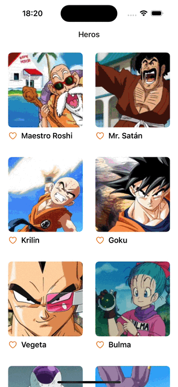
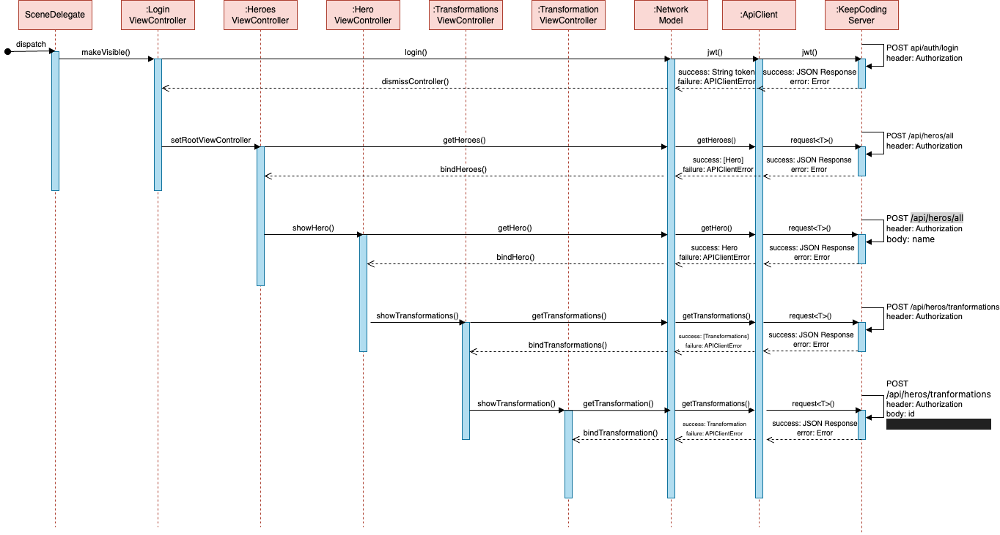
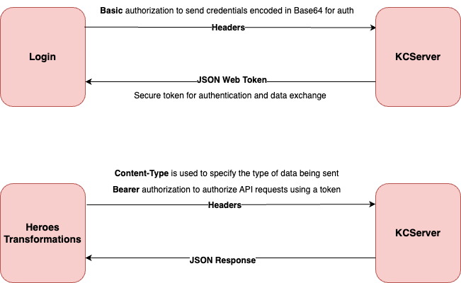
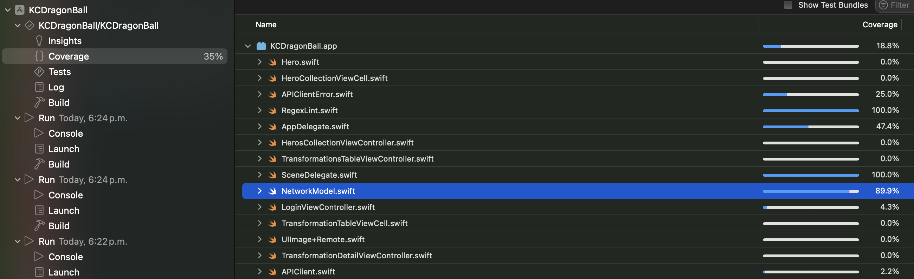

# dragon_ball

An app inspired on the iconic anime Dragon Ball Z

## Features Included
* Login
* Heros Album
* Hero Detail
* Transformations Album
* Transformation Detail

## Screens
| LaunchScreen | Login |
|--------|------|
|   |  |

| Heros | Transformations |
|--------|------|
|   |  |

## MVC Architecture

This project uses the MVC architecture, the project has api and domain models, XIB's for views and controllers. The first root controller is the `LoginViewController` but after a login success it is replaced by the `HerosCollectionViewController` using the `SceneDelegate`.

## API Calls

 

## Concepts Applied
* Configure a project from `SceneDelegate`
* `Storyboard` and `XIB`'s to place UI elements
* `Autolayout` and `UIStackView` to resolve the position and size of UI elements
* App lifecycle as general information
* `UIViewController` lifecyle to know where configure UI elements
* Cocoa Model View Controller to define and architecture of our project
* UINavigationController for navigation between controllers
* `UICollectionView` and `UITableView` to create grid collections and lists
* Diffable Data Source to handle the data in a list
* Delegate pattern to delegate behaivour to another classes
* Extensions to add custom functionality to a type
* ARC to handle weak references in memory, especially in closures.
* `URLSession` to download/upload data from a `URL` (asynchronously).
* `Result` type to represent either a Success or Failure response.
* Use of `Data`, `URLResponse`, and `Error` types.
* `Encodable` to convert structs to Data, and `Decodable` for the inverse process.
* Generics to write flexible, reusable generic code.
* DispatchQueue to send data to the UI on the main thread.
* `URLRequest` to represent a request to the server, containing a `URL`, headers, and methods such as `GET`.
* `XCTest` to add unit tests for the data layer.
* Control and manipulation of dependencies to add Test Doubles (mocking).
* Human Interface Guidelines and `SFSymbols` to customize UI elements
* Useful things of my previous project [SnowTrails](https://github.com/anagumo/snow_trails) such as Logger and RegexLint

## Testing 

The project has a coverage of 35% for unit testing wich the 89.9% is from the `NetworkModel`
